# Correcting a lake model with observations

Alplakes runs one-dimensional Simstrat simulations for a large set of Swiss lakes. The models are calibrated, and they can still be significantly wrong from time to time (errors of up to 2 °C, sustained for weeks, are ordinary). Meanwhile, moored thermistor chains and profilers sit in several of those same lakes reporting temperature every few minutes/hours.

Data assimilation is the right machinery for putting those two things in the same product. This post documents the module we built for it, in collaboration with the Canton of Ticino: the filters, the choices behind them, results across seven lakes, and, with equal weight, the things that still don't work properly.

A large share of the effort described here went into making the filter *more fair*, and it did not make it *more accurate*.

---

## 1. What it looks like

<div align="center">
  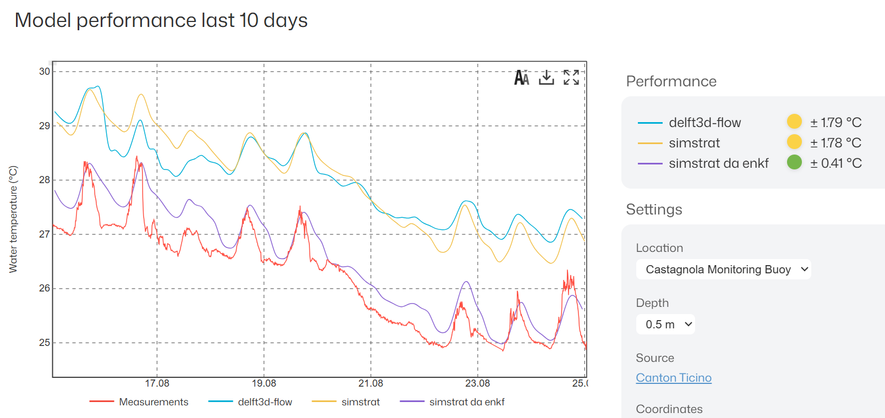
</div>

This is the Alplakes performance panel for the Castagnola buoy on Lake Lugano at 0.5 m depth, data from Canton Ticino at the end of August 2026. The red line is the measurement. In summer both models sit well off it: Delft3D-FLOW about 1.8 °C, and Simstrat, the 1D model under focus here, also about 1.8 °C. The assimilated Simstrat run, sharing the same calibrated 1D model with the filter switched on, is at 0.41 °C error.

That panel is the operational BETA for Upper Lugano, and it is roughly what the finished product should look like. We are now extending (and calibrating) the filter to six further lakes with high-frequency in-situ data: Ägeri, Greifensee, Murten, Maggiore, Geneva and Hallwil.

## 2. What the module provides

Any ensemble filter needs four ingredients:

- **An ensemble:** N perturbed copies of the model run in parallel, each with its own restart file. The spread between members is the model's uncertainty.
- **Observations:** measured values at known times, with a *stated* uncertainty that tells the filter how much to trust them.
- **A state vector:** what gets corrected at each update. For the 1D model in our experiments the temperature profile.
- **An update cycle:** the model runs until an observation arrives, the filter computes a correction for each member (or samples among the members), the corrected state is written back into the restart, and the model carries on until the next observation.

In practice that means we need a calibrated model, a real-time in-situ data source, an ensemble mechanism, and a filter. The module provides the last two:

1) A forcing-perturbation mechanism, which is how the ensemble is generated.

2) Two interchangeable engines: a customisable Python implementation and a parallel OpenDA setup, running a simple selection of the best-fitting member (Python), a particle filter (OpenDA), an Ensemble Kalman Filter (Python and OpenDA), and further versions thereof (OpenDA).

It is currently designed for lakes with high-resolution in-situ profiles at at sub-daily frequency.

The **Ensemble Kalman Filter (EnKF)** updates the state by weighing two uncertainties against each other: how wrong the ensemble thinks the model is, and how wrong we say the observation is. The Kalman gain can be read as a trust ratio: if the ensemble is confident, the observation moves the state very little; if the ensemble is uncertain, the observation wins and pulls the state a lot. The property that makes this filter attractive for a lake column is that information propagates in depth through the ensemble covariance, which comes from the model spread and so reflects the model physics: an observation at one depth can correct the whole profile, by an amount the ensemble says those depths move together (and, in a 3D model, this also translates to whole regions of the lake). We use the *stochastic* EnKF: where each member is updated with its own perturbed observation, to avoid ensemble collapse.

The **Particle Filter (PF)**, on the other hand, never builds a correction. It re-weights and clones whole member states in proportion to their likelihood, so every surviving trajectory stays a physically untouched Simstrat run. The price is that the analysis can only ever contain states the model itself produced: if no member happens to have the right profile, there is no mechanism to produce a fitting one.

> **Why an ensemble filter and not a standard Kalman filter?** The models are nonlinear, which a classic KF handles poorly. An ensemble method treats the model as a black box, so the same strategy transfers to other models (see §12.5); it needs no derivatives to build the error covariances; and the members run naturally in parallel. The EnKF is our main method; the PF is kept as a check and optional method.

## 3. Where the spread comes from

You cannot run an ensemble filter without spread, and the spread has to come from a defensible source. We generate it by perturbing the meteorological forcing, a major and well-known uncertainty factor for lake models. **This forcing perturbation is the only component that generates spread in the module right now.**

<div align="center">
  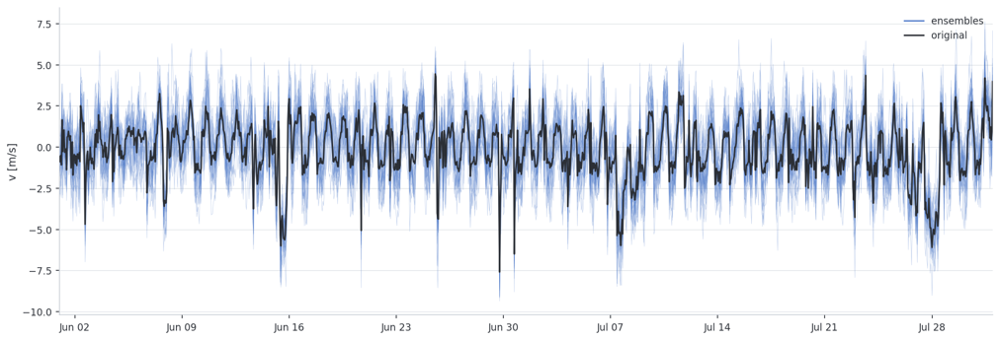
</div>

The figure shows a blue ensemble envelope around the black control station forcing, here for one wind component in Lugano Lake during July 2025.

**Only three variables are perturbed: wind U, wind V, solar radiation.** Temperature, vapour pressure, cloud cover and rain pass through untouched. Those three dominate the surface momentum and energy budget, and restricting to them keeps the mechanism simpler and potentially more interpretable.

Each member gets one AR(1) noise series added to the control forcing, so that the perturbation carries part of the temporal correlation of real forcing errors:

```
xₜ = φ·xₜ₋₁ + σ·εₜ ,      ε ~ N(0,1)
```

We assume that the **amplitude** of the perturbation represents the mismatch between the lake's reference meteorological station and the average conditions over the lake, and measure it as the standard deviation of the ICON reanalysis averaged over the lake minus the control forcing, `s = std(ICON − control)`. The **persistence** `φ = exp(−1/τ)` cannot be measured precisely: we bracket it between two proxies, the autocorrelation of the residual series and of the station signal itself, and take the end that gives *more* persistence, hence more spread, which benefits the EnKF. The size of one hourly kick then follows as `σ = s·√(1−φ²)`.

The practical advantage is that **the ensemble is generated at the forcing, not at the state.** Members diverge the way the weather diverges, and each one remains a physically consistent Simstrat run. This keeps the filter from shocking the model when it injects a correction.

---

## 4. When to assimilate

<div align="center">
  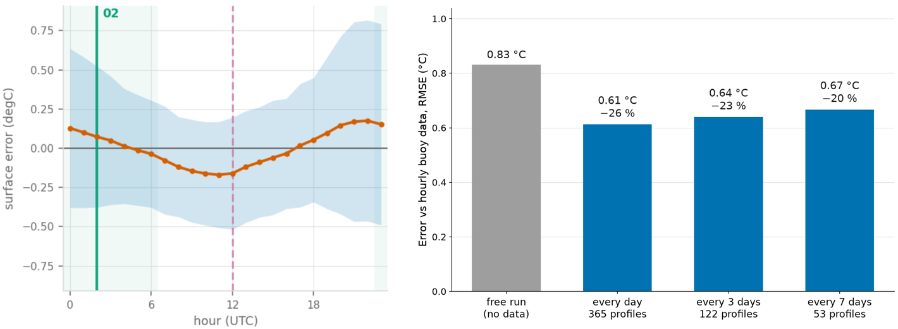
</div>

The left figure shows the daily distribution of error bias and random for Lake Geneva, The right one the decrease in accuracy of the assimilation with decreasing frequency for Lugano Lake.

**Daily:** A daily frequency reduces the error correlation between successive analyses, and avoids a sub-daily reversal of the error sign eating into the gains. Assimilating more often would make the filter less efficient (information counted twice) and noisier (potential reversals of the corrections). Going below daily, on the other hand, costs accuracy: daily outperforms the lower frequencies we tested. On Upper Lugano in 2025, scored against hourly buoy data, the free run's 0.83 °C drops to 0.61 °C (−26 %) with daily assimilation (365 profiles), 0.64 °C (−23 %) every 3 days (122 profiles) and 0.67 °C (−20 %) every 7 days (53 profiles).

**At a specific hour:** Using a free run, we take the mean and standard deviation of the model–observation error over the days, hour by hour, and pick the hour that maximises the random (correctable) error per amount of bias injected. The reasoning: the deterministic part of the gap is potentially a correction for something the model's physics will undo. By this measure **noon, the hour used by the current BETA, turns out to be among the worst possible choices.**

**At night:** Candidates are restricted to 23–06 UTC, so that every lake is sampled at a comparable point in its diurnal cycle, with the operational bonus that it is off-hours.

Only hours the lake actually samples are candidates, with adaptation where a fixed frequency cannot be guaranteed. This is a significant change from the setup in the previous post.

---

## 5. The observation problem

### 5.1 The raw signal at depth is not the signal we can use

<div align="center">
  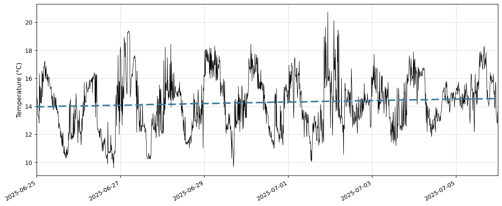
</div>

A raw temperature observation at 11 m depth, 25 June to 5 July 2025, Upper Lake Lugano. The sensor swings by up to **10 °C within a few hours**. The dashed line is what Simstrat predicts at the same times, and it is nearly flat, with only an underlying trend visible. (The series is debiased here to make the contrast more visible.)

The cause is internal wave motion: the steep thermal gradient is displaced vertically past a fixed instrument. The sensor is right and the signal is real.

But **a 1D model cannot reproduce it by construction**. There is no horizontal dimension for an internal wave to propagate in. So this variability, which can exceed the entire actual model–observation discrepancy we are trying to correct, is not an error the filter should try to fix. Feeding these thermocline-displacement excursions to the filter would continuously drag the whole column toward an unstable state that the model cannot maintain.

### 5.2 Filtering the observations causally

<div align="center">
  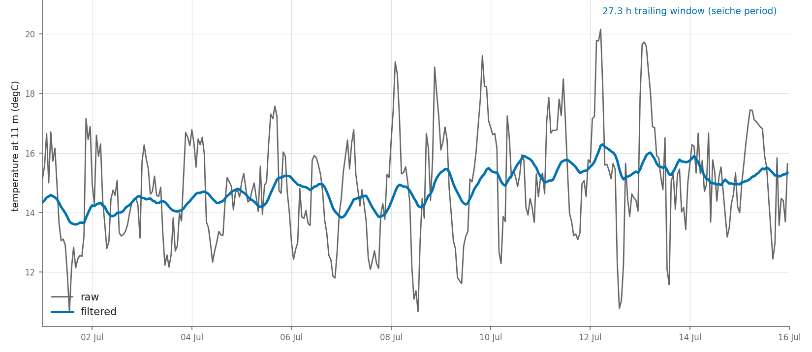
</div>

Here we have the original timeseries of the temperature at 11 in upperlugano in black (already aggregated to hourly) and the filtered observation with 27.3h trailing seiche defined window in blue. The fix is to remove large part of the signal the model cannot represent. Three constraints shape the solution:

- **It must be causal:** no leakage of future information, because this runs operationally (a centred moving average would be better but useless). We use a trailing moving average.
- **It must be split in depth:** above a threshold (currently 4 m) the series passes through untouched. Surface temperature does not suffer thermocline displacement in the same way, and we do not want to blur a signal that is genuinely fast.
- **It must be set physically, per lake:** the trailing window comes from a two-layer approximation, using the lake length and its stratification at peak, giving a characteristic fundamental internal-seiche period for each basin.

Residual variability at depth drops from around 10 °C to roughly **1–1.5 °C**. Still not small, but far more digestible for the filter.

### 5.3 Too many sensors
<div align="center">
  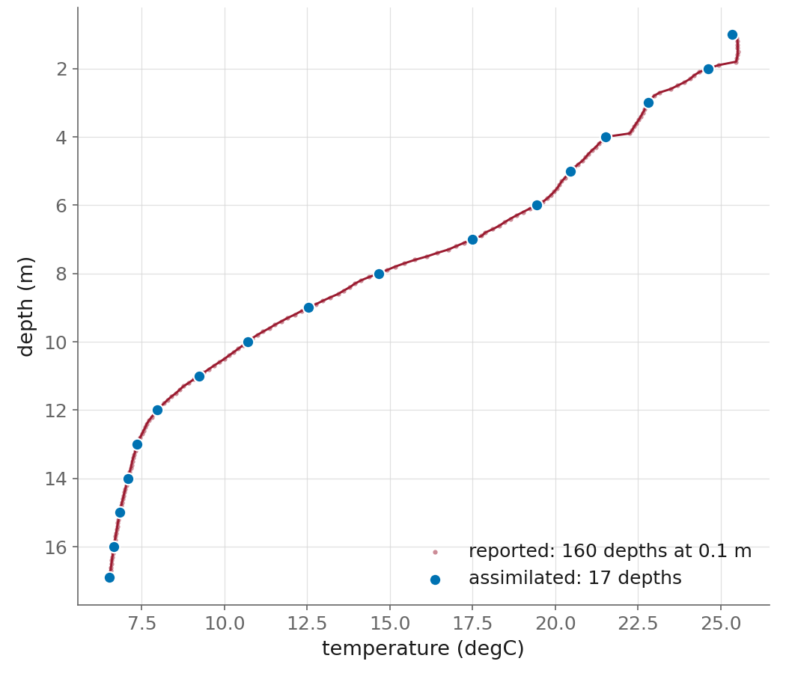
</div>

Profilers and moorings differ in vertical and temporal resolution, and a filter that ingests whatever it is handed behaves differently on each. Some instruments, such as those on Ägeri and Greifensee, report at sub-metre resolution (above: 160 depths at 0.1 m). **Neighbouring sensors at that spacing are near-copies**: two thermistors 10–25 cm apart in a well-mixed layer report the same water, and their error is essentially one error, not two independent ones. The filter counts them as independent evidence and can grow over-confident, pull too hard toward the observations and shrink the posterior spread. With only 20 members, ensemble collapse is something we want to avoid as much as possible.

The solution is a per-lake **target vertical grid**: dense profiles are thinned to a manageable resolution (here 17 assimilated depths), preferring the depths with fewer gaps. That also makes the seven lakes comparable with each other. The large observation uncertainty defined below further counteracts the residual over-confidence.

### 5.4 σ is not instrument error
<div align="center">
  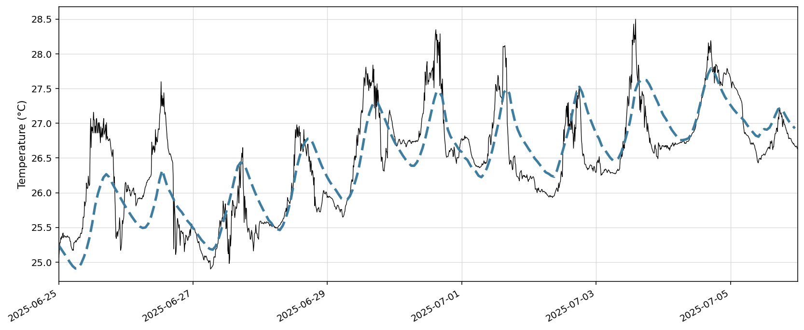
</div>

The observed ~1 m series (black) against the model (dashed), over a summer time window in 2025 in Lake Lugano, again debiased. The unrepresented variability is still present in smaller magnitude at filtered depths but *also at unfiltered depths*, and this mismatch cannot easily be covered by spread generated through forcing perturbation alone: we are asking the ensemble to cover variability that no member could ever produce with the current setup.

The sensors are accurate; their precision is not the issue. So the uncertainty we hand the filter has to come from somewhere else, or the filter will pull far too hard toward the observations. We therefore define σ **not as instrument error but as representativeness error**: an honest statement of what the model cannot reproduce. It varies by lake, by depth, and by season. That is partly process: variability, like the internal-wave signal above, that a 1D column cannot reproduce. And it is partly space: a buoy measures one point, while Simstrat represents a horizontally averaged column for the whole lake. It varies by lake, by depth, and by season.

### 5.5 A simple operational recipe

For the operational setup we make three deliberate simplifying assumptions: the observation uncertainty is **fixed in depth**, **seasonal** (mixed vs stratified), and **comparable from year to year**.

**The recipe:** take the gap between a free run and the filtered observations at the assimilation times over a reference year (for the results presented here, 2025). Split the series into seasons and remove each season's own mean (that is bias, not random uncertainty). Take the standard deviation of what remains as a variability proxy, and aggregate with the median across depths. This is deliberately the simplest generalizable approach we could come up with that can be justified and run operationally.

| season | upperlugano | maggiore | greifensee | geneva | aegeri | hallwil | murten |
|---|---|---|---|---|---|---|---|
| **mixed** | 0.30 | 0.70 | 0.52 | 0.28 | 0.24 | 0.41 | 0.34 |
| **stratified** | 0.59 | 1.17 | 0.94 | 0.59 | 0.24 | 0.39 | 0.60 |

The stratified season generally wants a larger σ, exactly what you expect if the dominant error source is thermocline displacement. Two lakes break the pattern: Ägeri, which we restrict to a single scalar because the seasonal split performed worse, and Hallwil, whose mixed season is marginally *larger* than its stratified one and represents an odd case.

> σ here is the honest statement of what the model cannot reproduce. The uncomfortable part is that it still occupies essentially the whole uncertainty budget (the ensemble remains too narrow).

---

## 6. Results

### 6.1 Which filter

Pooled hourly over the year, all depths, RMSE in °C:

| Lake | free run | Selection | PF (OpenDA) | EnKF (OpenDA) | EnKF (native) |
|---|---|---|---|---|---|
| upperlugano | 0.83 | 0.69 | 0.75 | **0.61** | **0.61** |
| maggiore | 1.54 | 1.43 | 1.58 | 1.14 | **1.10** |
| greifensee | 1.09 | 1.67 | 1.25 | **0.78** | 0.79 |
| geneva | 1.35 | 0.94 | 0.90 | **0.77** | 0.78 |
| aegeri | 0.46 | 0.84 | 0.78 | **0.30** | **0.30** |
| hallwil | 0.93 | 0.87 | 0.72 | **0.45** | 0.47 |
| murten | 0.72 | 0.95 | 0.84 | **0.47** | **0.47** |

The same comparison restricted to the **top 10 m**:

<div align="center">
  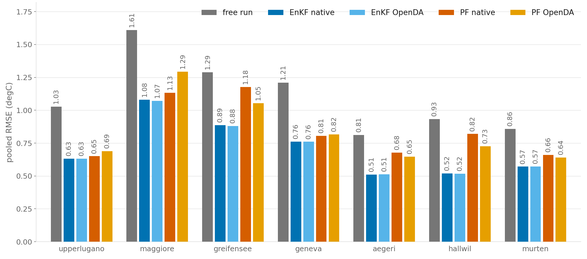
</div>

**The EnKF wins on every lake, on both engines, and not marginally.**

**Best-member selection is worse than not assimilating at all on three of seven lakes:** Greifensee (1.67 vs 1.09), Ägeri (0.84 vs 0.46), Murten (0.95 vs 0.72). If no member has the right profile, selecting one cannot help, and collapsing the choice to a single member appears to be worse than resampling more often than not. The two Ticino lakes are the exceptions where both selection and PF help.

**The native and OpenDA EnKF agree to within 0.01–0.04 °C on every lake.** The two configurations are built from identical inputs, identical perturbed forcings, identical warmup and identical observation series. The agreement validates our custom implementation.

**In the top 10 m the PF and selection perform much closer to the EnKF:** near the surface the perturbation acts directly, so the ensemble develops genuine spread and picking the best member can pick a modified enough profile. At depth the members are very close to each other, there is nothing to choose between, and the member selected for its surface fit arrives carrying its own deep profile. The PF's failure is a deep-profile failure, and it is the concrete cost of not building a per-depth correction.

### 6.2 The EnKF gains

| Lake | RMSE free | RMSE native | RMSE OpenDA | gain native | gain OpenDA | levels improved (native) | levels improved (OpenDA) |
|---|---|---|---|---|---|---|---|
| upperlugano | 0.83 | 0.61 | 0.61 | −26.3 % | −26.6 % | 16/16 | 16/16 |
| maggiore | 1.54 | 1.10 | 1.14 | −28.5 % | −26.2 % | 16/16 | 16/16 |
| greifensee | 1.09 | 0.79 | 0.78 | −27.1 % | −28.4 % | 130/160 | 136/160 |
| geneva | 1.35 | 0.78 | 0.77 | −42.5 % | −42.7 % | 44/44 | 44/44 |
| aegeri | 0.46 | 0.30 | 0.30 | −35.2 % | −34.3 % | 229/239 | 228/239 |
| hallwil | 0.93 | 0.47 | 0.45 | −49.2 % | −51.3 % | 19/19 | 19/19 |
| murten | 0.72 | 0.47 | 0.47 | −34.2 % | −34.2 % | 18/18 | 18/18 |

Pooled hourly over the year, for each depths, RMSE in °C:

<div align="center">
  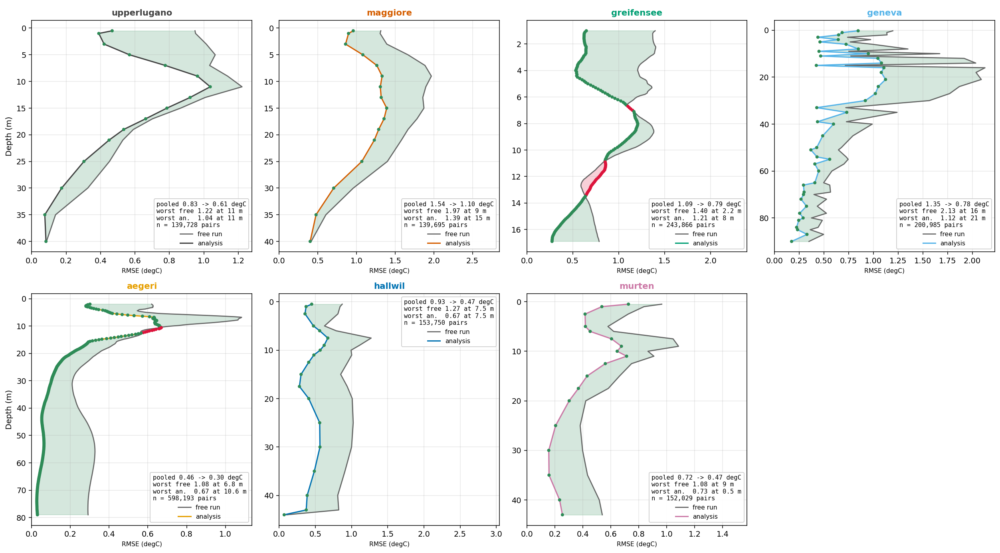
</div>

Free run in grey, analysis in colour, green fill is the gain.

**Every lake improves by at least 25%**. On five of seven lakes *every single model level* improves. The exceptions are Greifensee (around 7 m and between 11 and 13.5 m) and, more mildly, Ägeri (between 11 and 13 m). **Every lake's error peaks at the thermocline or at the surface, and the analysis lowers that peak without moving it.** The filter does not relocate the difficulty. Gains are often largest at the surface, and on some lakes the two curves converge in the deeper layers. Geneva's and Halwill's spikes are data gaps.

### 6.3 In time and depth

<div align="center">
  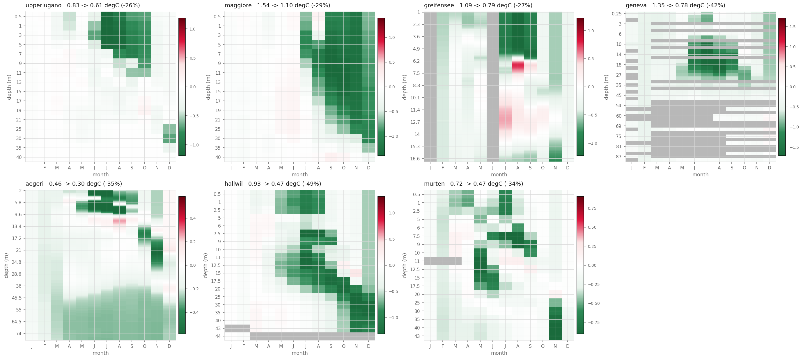
</div>

The same gain resolved by month. On Upper Lugano, Maggiore, Hallwil and Murten a **green staircase descends with depth through the year**, following the seasonal stratification.

The filter can only correct effectively where it has covariance, a model-observation gap, *and* where ensemble spread exists. Our spread is created at the surface, by wind and radiation, and reaches depth only by mixing. So the staircase traces the depth to which the ensemble is still dispersed effectively and where significant model error is present.

In winter the model errors are smaller, so corrections and gains are smaller too, and the panels fade toward white. Most of the significant red patches, where the analysis is worse than the free run, group around the thermocline in summer: it remains the challenging region.

### 6.4 The gains from observation filtering
<div align="center">
  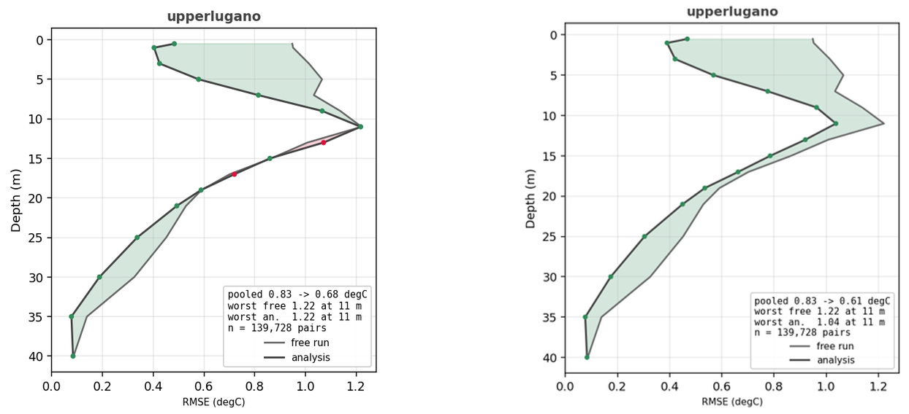
</div>

All results above are on filtered observations. Both panels here are Upper Lugano, scored (pooled RMSE °C over the year) against the same raw hourly data and the comparison is for data assimilation in 2025. Without filtering (left) almost nothing is achieved at the thermocline, and the red fill around 13 and 17 m says it was made slightly worse: the filter is chasing a signal it cannot represent and fails to inject it into the simulation. With filtering (right) we get an improvement everywhere. The data becomes more meaningful, and more digestible, for the filter and we get the hoped improvement at intermediate depths.

---

## 7. Is the filter honest? 

Accuracy is one question. Whether the filter's *stated* uncertainty matches the errors it actually sees is a different one.

### 7.1 The uncertainty budget

<div align="center">
  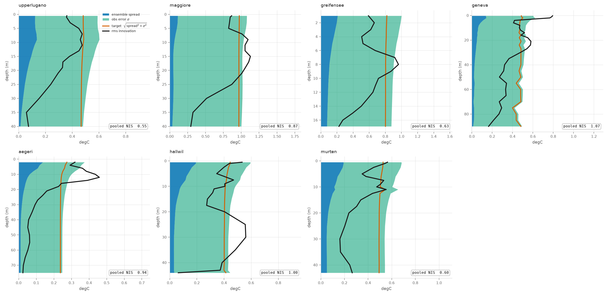
</div>

Blue is ensemble spread, green the assumed observation error, black the model–observation gap, orange the pooled target √(spread² + σ²), which is what the filter expects the gap to be.

**The observation error occupies essentially the whole uncertainty budget, and the spread collapses to near zero at depth for certain lakes**, a direct consequence of perturbing only surface forcing. This balance is what actually governs how large the corrections can be.

The model–observation gap (black) falls with depth on every lake, after a local maximum at intermediate depths. Where black and orange disagree the filter is not self-consistent: where black crosses above orange it is over-confident, where it sits below it is damped. Ägeri and Hallwil appear again as outlier cases. Overall, the setup tends to be over-cautious.

### 7.2 In time and depth

<div align="center">
  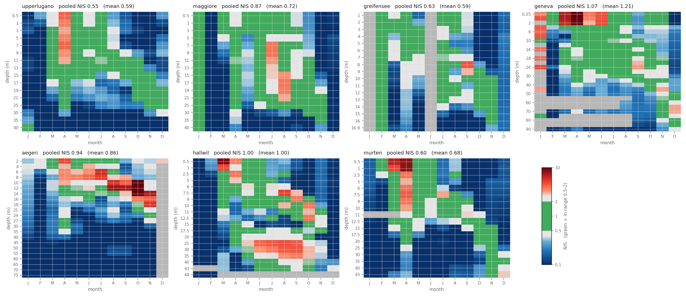
</div>

The same comparison resolved in time, as the normalised innovation squared (NIS), `d² / (spread² + σ²)`: green is consistent, blue over-damped, red over-confident. **The map is mostly blue**: the filter is systematically too cautious and assumes more error than it actually sees. Observations in the deep column are particularly affected by the fixed-profile approximation and are trusted far too little. Where the filter *is* over-confident is spring, during the large model biases, and then sporadically in the deeper layers. Ägeri, with a very polarised profile in depth, and Hallwil are the odd cases.

### 7.3 What the corrections look like

The figure shows the absolute EnKF correction per analysis against depth for each lake, on a log scale: thick bars mark the typical range (interquartile range), thin lines the full range, dots the median at the observed depths, and the box gives the median and the largest single correction.

<div align="center">
  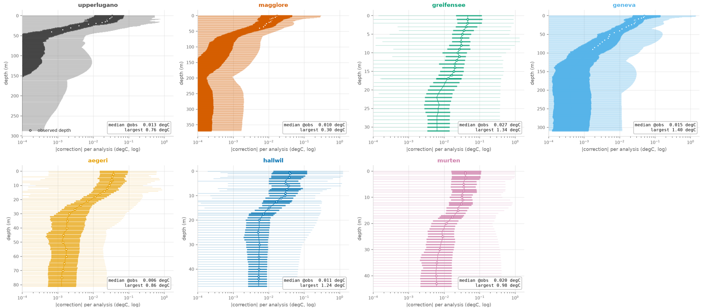
</div>

Because the spread is narrow and the observation error large in proportion, corrections are steered toward the observations only weakly: **median increments over column and time are 0.006–0.027 °C**, typically much smaller than the spread or the gap. The large increments (up to 0.3–1.4 °C) come from large innovations, and those live at the surface and, above all, where the model's thermocline and the observed one disagree. Below the stratification the correction magnitude decays down to a flat minimum, a structure that probably reflects the mixing activity in each lake.

---

## 8. Is assimilating the surface enough?

A practical question with real consequences: several lakes have a surface station and nothing else. We test this on two lake sections where only surface data is available: Lower Lugano and Lower Zürich.

### 8.1 The good
<div align="center">
  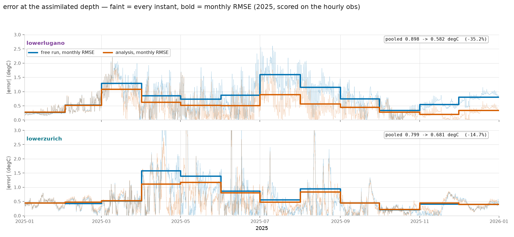
</div>

Both use the same seasonal σ recipe as §5.5, applied to the single surface depth: Lower Lugano 0.41 °C mixed / 0.61 °C stratified, Lower Zürich 0.65 / 0.88 °C.

Both lakes improve at the assimilated depth of 1 m, but very unequally. **Lower Lugano 0.90 → 0.58 °C (−35 %); Lower Zürich 0.80 → 0.68 °C (−15 %).** The difference is most probably about the character of the error rather than the filter. Zürich's baseline is low (around 0.4 °C) for most of the year, with shorter large excursions. In January–February, and in November–December for Zürich, the two curves are indistinguishable: the free run is already right and there is little for the filter to act on. The gap opens in March for Lugano and April for Zürich, and stays open through the stratified season, with the biggest improvement in July for Lugano and April for Zürich.

### 8.2 The bad
<div align="center">
  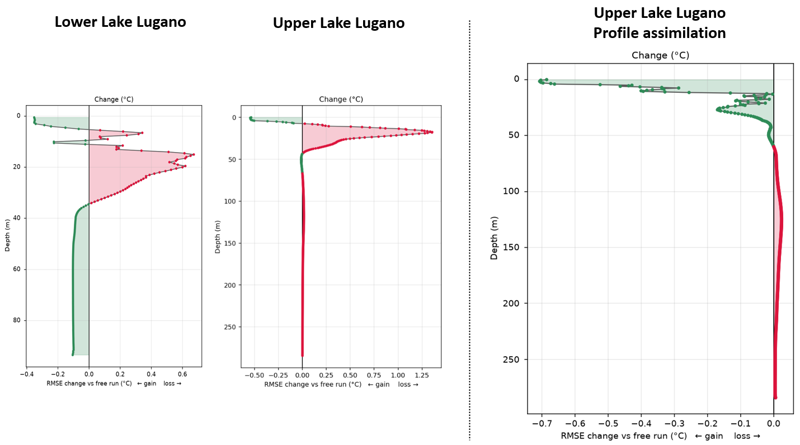
</div>

Left, Lower Lugano with surface-only assimilation. Right, Upper Lugano assimilating the full profile. Both scored against CTD casts, a sub-optimal reference: casts are instantaneous and very exposed to the variability problem of §5.1, while our assimilation works on filtered daily values, and the two panels are different lake sections. Surface-only gains at the top and, weakly, in the deep in lower Lugano. Similar results are obtained when assimilating the upper Lake Lugano section with surface mesurments only (note: deep results change). **Between them it loses badly: the RMSE degrades by up to 0.65 °C between roughly 10 and 35 m, more than the 0.4 °C it gains at the surface.**

**Profile assimilation gains almost everywhere** down to 60 m, up to 0.7 °C at the surface, and below that does essentially nothing, within 0.02 °C of the free run all the way to 280 m.

Profile assimilation shows clearly better gains against CTD, and it appears to do little harm where it has no information; **having profile information over the whole upper 30–40 m seems to be essential for correcting a 1D model.**

The model is 1D, so no matter how many stations report, the filter must be handed one value per depth. The freedom is in how that value and its uncertainty are constructed. We tested several alternatives. We tried defining σ from **the observations alone** rather than from the model gap: when the spread *between stations* is large (from climatology), trust the value less; when a value is derived from *more* stations at run time, trust it more. We tried localizing the corrections (§10), and arbitrarily prescribing a low σ of 0.3 °C. **The results change only at the surface and none of them improved the comparison against the CTD profiles.**

---

## 9. Trying to calibrate better

A single fixed σ by season is simple, well suited to operational use, and already gives significant improvement across the year and the water column. But the simple recipe has clear drawbacks, and each one suggests a fix. We tested some of them.

- Seasonal aggregation assumes a clean mixed/stratified split, at the same calendar dates, across lakes and years. A finer temporal resolution (say monthly) would need more history than we have, and monthly conditions vary a lot from year to year.
- Thermocline layers in summer remain challenging to assimilate.
- Deep observations are trusted far too little, because their true representativeness error is much smaller than the depth-median.

In the tables below, "calibration" is the pooled NIS: 1 is perfectly consistent, below 1 over-cautious, above 1 over-confident.

### 9.1 Resolving σ in depth

Same fitting concept, resolved by depth instead of collapsed to a median.

| lake | gain, simple | gain, σ(z) | NIS simple (all / mixed / strat.) | NIS σ(z) (all / mixed / strat.) |
|---|---|---|---|---|
| upperlugano | −26.3 % | −25.5 % | 0.55 / 0.73 / 0.51 | 0.56 / 0.68 / 0.52 |
| maggiore | −28.5 % | −28.4 % | 0.87 / 0.38 / 1.04 | 0.91 / 0.38 / 1.13 |
| greifensee | −27.1 % | −28.5 % | 0.63 / 0.55 / 0.64 | 0.65 / 0.41 / 0.73 |
| geneva | −42.5 % | −41.8 % | 1.07 / 1.54 / 0.98 | 0.62 / 1.18 / 0.55 |
| aegeri | −35.2 % | −28.5 % | 0.94 / 0.66 / 1.14 | 0.75 / 0.63 / 0.79 |
| hallwil | −49.2 % | −50.6 % | 1.00 / 0.54 / 1.46 | 0.62 / 0.41 / 0.79 |
| murten | −34.2 % | −30.9 % | 0.60 / 0.96 / 0.50 | 0.62 / 0.66 / 0.59 |

The structure of the budget looks visibly better: σ now follows the shape of the innovation profile instead of cutting across it. But the overall calibration stays about the same, because fixing the shape redistributes the misfit rather than removing it (the budget is more evenly distributed, not better in the pool). **And the RMSE gain barely moves**, while on Ägeri it gets notably worse (−35.2 → −28.5 %). The depth fit changes the *shape* of the uncertainty profile but not its *level*.

### 9.2 Fixing the level
<div align="center">
  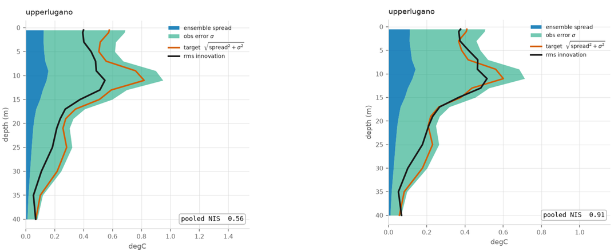
</div>

The depth fit had the right shape and the wrong amplitude: the uncertainty assigned is in general too large. That is expected: the fit is made against a free run's model–observation gap, and the filter exists precisely to close that gap, so the innovations it later sees are smaller by design. So the second step fits the level explicitly. We take a previous run's uncertainty profile and rescale it against **that run's own innovations**, with four numbers per lake to keep the risk of overfitting as low as possible: above and below 4 m (where the seiche filtering starts), for each of the two seasons.

| lake | gain, σ(z) | gain, scaled | NIS σ(z) (all / mixed / strat.) | NIS scaled (all / mixed / strat.) |
|---|---|---|---|---|
| upperlugano | −25.5 % | −26.9 % | 0.56 / 0.68 / 0.52 | 0.91 / 0.96 / 0.89 |
| maggiore | −28.4 % | −25.7 % | 0.91 / 0.38 / 1.13 | 1.13 / 0.87 / 1.16 |
| greifensee | −28.5 % | −30.5 % | 0.65 / 0.41 / 0.73 | 0.93 / 0.93 / 0.93 |
| geneva | −41.8 % | −41.9 % | 0.62 / 1.18 / 0.55 | 0.97 / 1.02 / 0.96 |
| aegeri | −28.5 % | −28.6 % | 0.75 / 0.63 / 0.79 | 1.00 / 0.94 / 1.01 |
| hallwil | −50.6 % | −49.9 % | 0.62 / 0.41 / 0.79 | 1.05 / 1.01 / 1.07 |
| murten | −30.9 % | −32.8 % | 0.62 / 0.66 / 0.59 | 0.94 / 0.99 / 0.91 |

**As a calibration test this works very well**, as expected: every lake lands close to 1. Spring and winter remain hard in opposite directions, which is the price of the remaining two-season approximation. **The RMSE gains move only a little, some up, some down, and the simple setup still beats this 
calibrated version in several cases.** This substantiates that filter self-consistency and filter accuracy are separate objectives: calibrating does not guarantee any improvement in performance. Some general tendencies of what calibrating changes are nonetheless visible. Calibration tends to score worse in 
spring, and that loss sits mainly at the surface. The depth-fitted experiments, on the other hand, tend to score better in deeper water and, for the scaled fit, in the winter months. At the thermocline we cannot generalise: of the two lakes with the largest losses there, Greifensee improves, closing part of
its intermediate-depth degradation, while Ägeri gets worse. Calibration can offer a targeted repair at difficult depths and times, but not a reliable one. How well this iterative fit would generalise to other years also remains questionable.

### 9.3 Letting σ follow the innovations

Both fits above are made offline, on a reference year, and assume that year stands for the next ones; the scaled fit also needs several steps. Here we propose a simpler approach that drops the generalisation problem. At each depth, σ² is the mean squared innovation minus the mean ensemble spread² over the 14 days before each analysis, `σ(z,t)² = gap² − spread²`. It needs no free run, no seasonal split, and no multiplier to fit iteratively. It is causal, and has one safeguard: a 0.05 °C floor. The 14-day window is needed to collect enough samples given the seiche filtering. The seasonal σ is only used for the first 14 days, until the window fills.

<div align="center">
  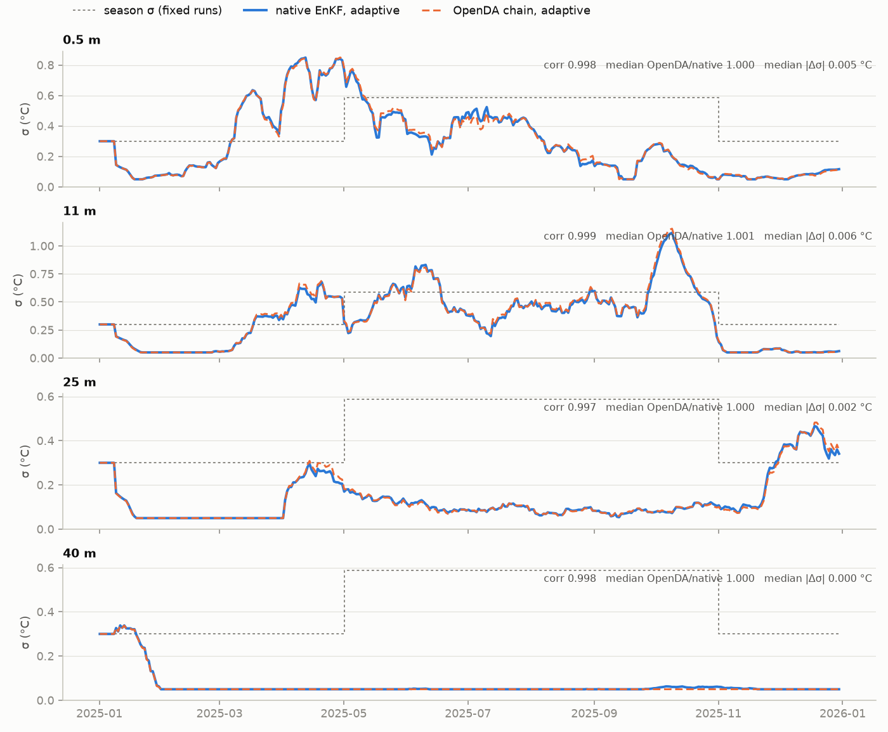
</div>

On Upper Lugano, σ climbs through the spring warming at the surface and peaks at the thermocline in October. Below 25 m it falls much lower than the seasonal value. Native and OpenDA pick the same σ (correlation ≥ 0.997).

**It is calibrated by construction, and it could be run operationally.** Its NIS of 1 is largely what the estimator is built to produce. **Pooled RMSE again barely moves** (−26 → −27 %), but the **gain has a location.** Where the seasonal σ distrusted the observations, the correction improves (e.g. at 30 m). The surface gives back one or two percentage points.

**Checked against data neither run assimilated.**
The 23 CTD casts of 2025 rule that out on this lake:

| depth (m) | free run | seasonal σ | adaptive σ |
|---|---|---|---|
| 0–4 | 1.03 | 0.33 (−68 %) | 0.35 (−66 %) |
| 4.5–12 | 1.00 | 0.63 (−38 %) | 0.62 (−38 %) |
| 12.5–18.5 | 0.55 | 0.50 (−10 %) | 0.47 (−15 %) |
| 19–35 | 0.33 | 0.23 (−31 %) | 0.20 (−37 %) |
| 35.5–60 | 0.14 | 0.13 (−9 %) | 0.12 (−11 %) |
| below 60 | 0.19 | 0.20 (+9 %) | 0.21 (+10 %) |

*RMSE (°C) against CTD casts, OpenDA chain, same 13,043 (time, depth) pairs for all three. The native engine gives the same picture to within two points.*

The casts confirm the buoy result: adaptive σ wins at 98 of the 121 CTD levels in the top 60 m, mostly between 7 and 60 m. It is slightly worse in the top 6.5 m and in a thin band around 18–22 m, and makes no difference below the deepest sensor.

The adaptive σ still hides the under-dispersion but problem better. It also has lag: after a quiet fortnight a sudden error could get over-trusted until the window catches up.

**Across seven lakes the method does not hold up.**

| lake | gain, seasonal σ | gain, adaptive σ | NIS seasonal (all / mixed / strat.) | NIS adaptive (all / mixed / strat.) |
|---|---|---|---|---|
| upperlugano | −26.3 % | −26.9 % | 0.55 / 0.74 / 0.51 | 0.99 / 1.00 / 0.98 |
| maggiore | −28.5 % | −25.7 % | 0.87 / 0.38 / 1.04 | 0.99 / 0.81 / 1.02 |
| greifensee | −27.1 % | −26.5 % | 0.63 / 0.55 / 0.64 | 0.92 / 0.73 / 0.97 |
| geneva | −42.5 % | −40.3 % | 1.07 / 1.54 / 0.98 | 1.00 / 1.05 / 0.98 |
| aegeri | −35.2 % | −13.6 % | 0.94 / 0.66 / 1.14 | 1.00 / 0.78 / 1.08 |
| hallwil | −49.2 % | −45.9 % | 1.00 / 0.54 / 1.46 | 0.98 / 0.87 / 1.03 |
| murten | −34.2 % | −30.8 % | 0.60 / 0.96 / 0.50 | 0.98 / 0.99 / 0.98 |

Every lake ends up with NIS near 1, as expected by construction. Upper Lugano is the only lake whose accuracy improves. The other six lose, most of them by a few points, and Ägeri loses more than half its gain.

<div align="center">
  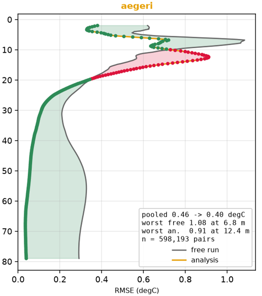
</div>

**Ägeri shows the failure mode well.** Judged on calibration alone the adaptive run looks perfect. On accuracy, the seasonal σ brings the error from 0.46 to 0.30 °C, the adaptive σ only to 0.40 °C, and the loss sits in a red band between about 10 and 20 m, from July to October, at the thermocline. The 
reason is probably a feedback loop. The estimator cannot tell whether a large innovation comes from the measurement or from the model, so it always assigns it to the observations. In late summer the model starts misplacing the thermocline, the innovations grow, and the method concludes the measurements have
become unreliable: σ at the thermocline climbs from 0.2 to 0.9 °C, the filter largely ignores the observation at that depth and corrects it only through what the covariance propagates from other depths, and the error keeps growing. A self-tuning error model can look perfectly consistent while degrading 
accuracy.

### 9.4 Why the seasonal σ stays operational, for now

Each alternative above calibrates better than the seasonal σ. None of them is clearly more accurate. For an unattended system, three things tip the balance.

**Simple.** The seasonal σ is two numbers per lake, fitted once and written in the config. Anyone can read them, both engines use them unchanged, and the filter's trust is known before the run starts. The adaptive σ is a moving quantity. It needs a two-week history of innovations that must survive restarts and outages.

**Cautious.** The two approaches fail in opposite directions, and only one of those directions is safe. The seasonal σ is too large (NIS ≈ 0.6), so the filter under-trusts the observations and corrections stay small. The adaptive σ can fall to its floor, and at depth it sits there most of the year, where the ensemble spread is also near zero. The filter then pulls hard exactly where it has little information about its own error. A sudden change after a quiet fortnight, whether a real event or a faulty sensor, is over-trusted until the window catches up. And because σ is estimated from innovations the filter itself shaped, errors can reinforce themselves in both directions. Good corrections shrink the innovations, which shrinks σ, so the filter pulls harder. A growing model bias enlarges them, which raises σ, so the filter lets go. On Upper Lugano the CTD casts show no harm; on Ägeri the second loop took more than half the gain (§9.3). The seasonal σ is measured against a free run the filter never touched, so it cannot enter either loop.

**Differences.** What do we give up? In general accuracy, nothing: the seasonal σ is as good or better on six of seven lakes, and Upper Lugano's advantage for the adaptive σ (−27 % against −26 %, with a real gain at 19–35 m) did not carry over to the other lakes. What we give up is an honest uncertainty: the seasonal filter often says it is less sure than it really is.

> **Note: does the fitting year matter?** The seasonal σ is independent of the filter, but not of the evaluation data: it was fitted on 2025, and every result in this post is scored on 2025. That is a data limitation. 2025 is the only year with profile observations on all seven lakes.
> Three lakes also have full records for 2023 and 2024 on an unchanged sensor chain: Ägeri, Hallwil and Greifensee. For those we refitted σ on 2023–24 and scored the result on 2025, changing nothing else.
>
> | lake | σ fitted on 2025 | σ fitted on 2023–24 | RMSE gain, 2025 fit | RMSE gain, 2023–24 fit |
> |---|---|---|---|---|
> | aegeri | 0.24 | 0.27 | −35.2 % | −34.3 % |
> | hallwil (mixed / strat.) | 0.41 / 0.39 | 0.33 / 0.53 | −49.2 % | −47.7 % |
> | greifensee (mixed / strat.) | 0.52 / 0.94 | 0.52 / 0.91 | −27.1 % | −27.6 % |
>
> The fitted values do move between years, by up to a third (Hallwil's stratified season). The result barely does. The gain changes by at most 1.5 points, and no depth differs by more than 0.03 °C. Hallwil's calibration even improves.
> So, where it can be tested, **the choice of fitting year matters much less than the recipe itself**. Two caveats: the test covers three lakes and one scored year, and the forcing perturbation is still the one fitted on 2025, because the ICON reanalysis it needs does not reach back to 2024.

---

## 10. Vertical localization

<div align="center">
  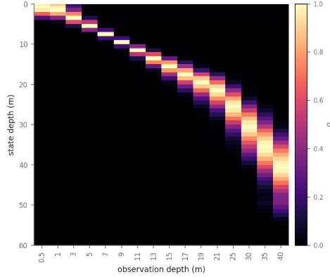
</div>

One thing we also tested is whether the failures in the deeper layers come from spurious correlations. With 20 members, a small correlation is indistinguishable from sampling noise, and without a limiting mechanism the filter acts on it anyway. Besides observations often stop well before the lake floor, and stratification complicates the profiles. Localization forces small correlations to zero instead of trusting them.

Radii are derived offline, per lake, from a free ensemble in the stratified season: the radius at a given depth is the smallest separation at which correlation first drops below a noise threshold (here in the example 0.45), then used as the support of a smooth taper (weight 1 at zero separation, falling to 0 at the radius). Two matrices built from the taper modify the Kalman gain. The radii come out narrow near the surface, where the gradient is sharp, and wider with depth, where the column is more coherent.

What it does mechanically: corrections from far-away cells shrink, less spread is removed in general, and the extra spread gives a larger gain on the links that remain.

<div align="center">
  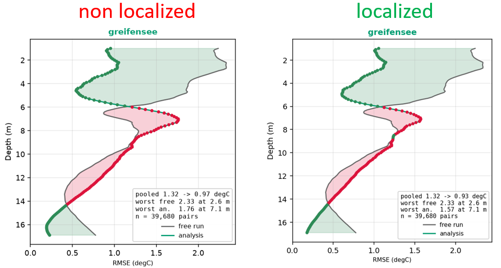
</div>

On Greifensee in August for example, localization brings the pooled error from 1.32 to 0.93 °C instead of 0.97 °C, and trims the worst analysis error at 7.1 m from 1.76 to 1.57 °C. But the band between about 6 and 14 m is still worse than the free run in both cases. **The improvements, when present, remain small.**

For now we provide it as an optional element rather than part of the operational configuration. **Long-range spurious correlations don't seem to be a central problem in our lakes in the current set up**. The scheme is measured per lake and ready for for test and to be integrated where that stops being true.

---

## 11. What we can say until now ...

**A fixed seasonal σ is ready and is a good operational solution:** 25 % or more improvement across seven lakes with high-resolution profiles, up to ~50 % in the best case.

**Forcing perturbations keep corrections small**, so the model is never shocked. That makes the scheme safe to run unattended.

**The large observation error also counteracts the over-confidence** that correlated, closely spaced observations would otherwise possibly generate.

**Near-surface seasonal bias is corrected reliably:** one of the major free-run failures.

**Profile data and seiche filtering each improve something at intermediate depths in summer**; filtered profile data is central to a filter that works over the whole water column.

**Surface assimilation improves the upper layers**, but it cannot satisfactorily correct the whole profile in a 1D model; against low-resolution CTD data we show evidence that it can significantly damage the layers just below.

**Calibrating is useful for consistency, not so much for accuracy:** optimising calibration across seven lakes changed the RMSE by almost nothing. Estimating σ on the fly made every lake consistent but six of seven less accurate with a major problem related to internal feedback.

**The work described here is almost entirely on the observation side. What is left is a model-spread problem.**

**When does the filter perform best?** It performs best in the stratified season, and only inside the mixed layer. The gain front follows the mixed layer down through autumn (§6.3), because the spread is made at the surface by wind and radiation and can only reach depth by mixing. So the filter is most useful exactly where the model has a seasonal surface-energy bias; less useful in winter, because the model is already right; and worst at the summer thermocline, because that error is structural. The next real gain comes from the model side, not from the observations.

---

## 12. What comes next

### 12.1 The ensemble is too narrow

The problems we tried to solve above with the observation-uncertainty workaround all point to an under-dispersed ensemble. In every calibration σ occupies almost the entire uncertainty budget, because the spread has little to contribute at depth. The single biggest limitation of the current setup: spread is generated only at the surface, through three forcing variables, and reaches depth only by mixing.

The obvious source of additional spread is the model itself. Three clear candidates, all already used in Simstrat's own calibration:

- `f_wind`: wind factor (wind speed is multiplied by it)
- `p_lw`: longwave radiation factor (longwave irradiance is multiplied by it)
- `a_seiche`: seiche factor, which sets how much wind energy is absorbed by internal waves

Two ways to use them. **Option one: add parameter spread by perturbing them.** Parameter differences are structural, so the analysis should have a harder time collapsing them, and it moves uncertainty away from the observation error and toward the model, where it partly belongs: more model spread means the observations are trusted more. **Option two: joint state–parameter estimation**, assimilating temperature and one or more parameters together; there is precedent in the literature (e.g. FLARE framework of Thomas et al. (2020)).

### 12.2 What parameter spread would potentially look like

<div align="center">
  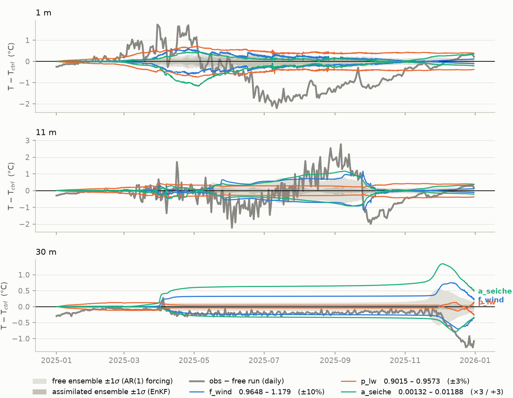
</div>

A sensitivity test over 2025: seven continuous free runs, identical unperturbed forcing and identical warm start, control plus a low/high pair per parameter (`f_wind` ±10 %, `p_lw` ±3 %, `a_seiche` ×3 / ÷3, all inside the lake-calibrator bounds). Shown with the control subtracted, at 1, 11 and 30 m, against raw hourly observations. Light grey is the free ensemble from forcing perturbation; darker grey the assimilated one.

At **1 m**, the error to explain reaches −2 °C in midsummer. The AR(1) forcing ensemble is about ±0.3 °C. The parameter envelopes reach 0.5–1.2 °C.

At **11 m**, observations minus free run peaks near +3 °C in September. The forcing spread is still around ±0.3 °C, but `a_seiche` and `f_wind` open to about ±1 °C, and they open *in the stratified season*, which is exactly where more spread would be particularly helpful.

At **30 m** the error is smaller, but more spread would still help.

So parameter variability could be a viable way to insert uncertainty into the deep column.

### 12.3 Option one: perturbing the parameters

We ran seven assimilation experiments on Upper Lugano, native EnKF (seasonal σ), 2025, 20 members. The only thing that changes is which model parameter is spread across the members, and by how much. Members are spread deterministically around the calibrated value, and the control member keeps it.

| perturbation | mean spread (°C) | spread below 19 m | pooled NIS | RMSE, hourly |
|---|---|---|---|---|
| none (operational) | 0.072 | 0.033 | 0.55 | −26.3 % |
| `a_seiche_w` ×/÷ 5 | 0.072 | 0.033 | 0.55 | −26.3 % |
| `f_wind` ±10 % | 0.074 | 0.034 | 0.54 | −26.5 % |
| `a_seiche` ×/÷ 5 | 0.082 | 0.039 | 0.55 | −26.1 % |
| `p_lw` ±5 % + `a_seiche` ±80 % | 0.084 | 0.036 | 0.50 | −27.3 % |
| `p_lw` ±10 % | 0.090 | 0.035 | 0.49 | −27.4 % |
| `f_wind` ±50 % | 0.108 | 0.052 | 0.48 | −27.3 % |
| `p_lw` ±25 % | 0.116 | 0.037 | 0.44 | −28.3 % |

**It works in the direction predicted, and it is small.** More parameter spread gives a slightly better analysis. The best case, `p_lw` ±25 %, moves RMSE from −26.3 % to −28.3 %, and it cuts the depth-months made worse by assimilation from 41 to 25 out of 192. The corrections become bigger (median 0.013 → 0.017 °C at the surface), which is what a filter with a wider ensemble is supposed to do.

**The amplitudes that achieve this are not defensible.** `p_lw` ±25 % is an eightfold exaggeration of the ±3 % used in the sensitivity test above, and the calibrated values across our seven lakes span less. The perturbations we *can* justify (`f_wind` ±10 %, `a_seiche` ×/÷ 5) change essentially nothing: 0.072 → 0.074 and 0.082 °C of spread. **σ still dominates** and the imbalance grows with depth.

<div align="center">
  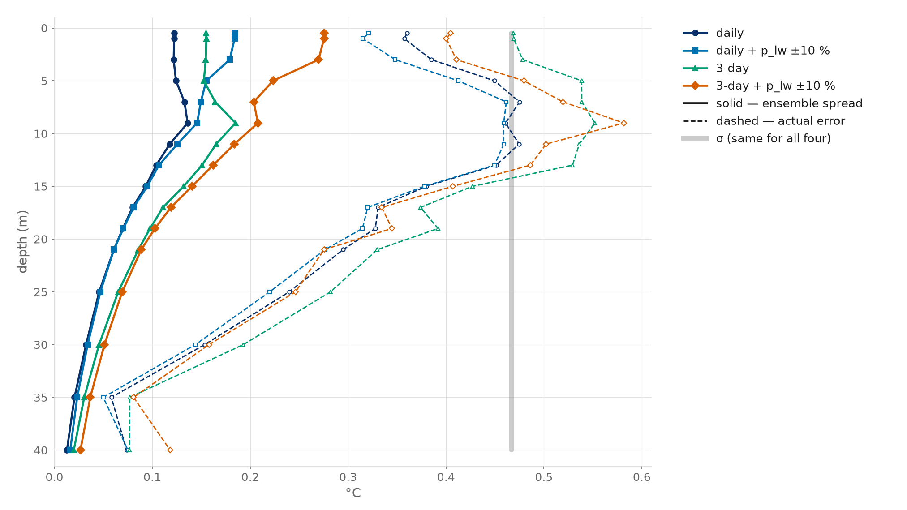
</div>

**Where it becomes interesting is at lower frequency.** Solid lines are ensemble spread, dashed the actual error it should cover, grey σ. With `p_lw` ±10 %, the spread grows by about a quarter at daily frequency, and by more than a third when assimilating every 3 days, because the parameter differences have longer to act between analyses. At 3 days this is enough to bring the accuracy back to almost exactly the daily result, while assimilating a third of the profiles. It is a quick test only: the deepest measurement actually got worse, so the way the additional spread is generated needs more care, but it is a promising direction.

### 12.4 Option two: estimating the parameters

<div align="center">
  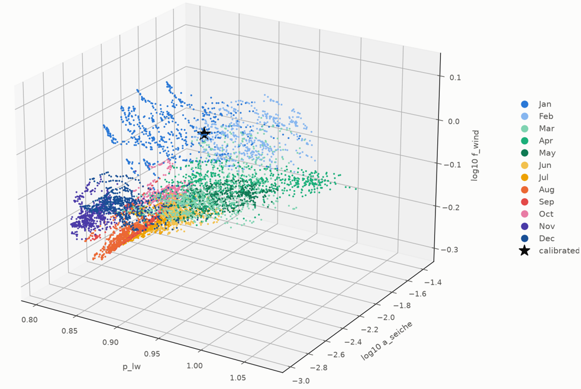
</div>

In the joint run the filter updates `f_wind`, `p_lw` and `a_seiche` at every analysis. At the start each of the 20 members draws its own set of values around the calibrated ones: `p_lw` with a 5 % spread in logit space, bounded to 0.8–1.2; `a_seiche` and `f_wind` in log space, with a spread of ×1.65 and about 10 %. The transforms keep the parameters positive and within bounds, and the draws are stratified and shuffled so the three parameters start uncorrelated. The transformed parameters are appended to each member's temperature profile as an extended state. Since they are not observed, they change only through their ensemble covariance with the observed temperatures, and the temperature update itself is unchanged. Between analyses they stay fixed. Each update narrows their spread; a floor holds the spread from collapsing. 

The cloud shows the members' values through 2025, coloured by month; the star marks the calibrated values. **They do not converge.** They keep moving with the seasons, with much less wind and much more seiche mixing in summer, and the longwave factor pinned to its lower bound. The filter is using the parameters to absorb the seasonal bias. The accuracy ends up the same as without updating them, but reached in a different way.

That opens real questions. Can a parameter be updated daily? Is 20 members enough for a joint state? Do the parameters stay physically defensible (broad bounds help, but probably something tighter is needed)? And there is an underlying attribution problem: we change the model's physics and its state at the same time on limited evidence, so the parameters can absorb errors that aren't theirs, and they trade off against each other.

What is interesting is that a single run both corrects the temperatures and yields a distribution of the parameters, which could be a cheap first estimate to compare against a traditional calibration or to analyse potential systematic model failures. Coming back to the spread question, the next step would be adding justified random variability to the model state itself: structural uncertainty through state perturbation.

### 12.5 Deep mixing

<div align="center">
  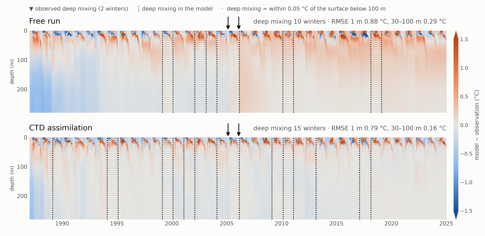
</div>

Can assimilation improve the representation of deep mixing in Simstrat? The buoy stops at 40 m, but for Lake Lugano there are almost 40 years of CTD casts, one every two weeks, down to 280 m, and we started by assimilating those. The profiles were thinned to a coarser grid as in §5.3; the seiche filtering is not possible on fortnightly casts.

The free run starts too cold in the deep water and slowly builds up a warm bias. It mixes all the way below 100 m in 10 winters, while the lake did so in only two (the arrows). With assimilation the deep temperatures are corrected: **RMSE between 30 and 100 m almost halves, 0.29 → 0.16 °C**, and at 1 m it drops from 0.88 to 0.79 °C.

<div align="center">
  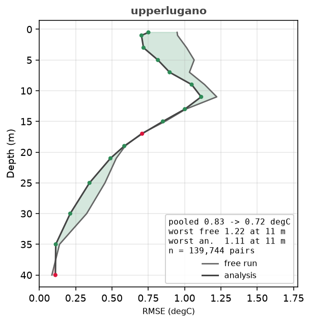
</div>

Against the 2025 buoy, which this run never saw, the error still drops from 0.83 to 0.72 °C. **But look at the dotted lines: deep mixing becomes more frequent, 15 winters instead of 10.** So for now, assimilating temperature fixes the temperature but tends to make the mixing worse. Correcting the state may change when and how deep the model overturns.

### 12.6 The same layout in 3D

A further objective is to show that the ensemble DA layout transfers to a 3D model, and can sit beside Simstrat in the module as an optional engine. Delft3D-FLOW on Lake Lugano, driven the same way: OpenDA treats the model as a black box, writes a restart file, launches the model in a container, reads the output, adjusts the restart, and repeats, so the simulation advances window by window. The model is expensive, so these experiments use 7 members instead of 20, over a one-month test window. A big new thing in 3D is that the covariance also spreads a single station's correction *horizontally* to nearby cells, so one buoy can inform a whole region. That is attractive, because we have few stations, and risky at the same time: with seven members, spurious horizontal correlations become a real concern, more so than in 1D.

<div align="center">
  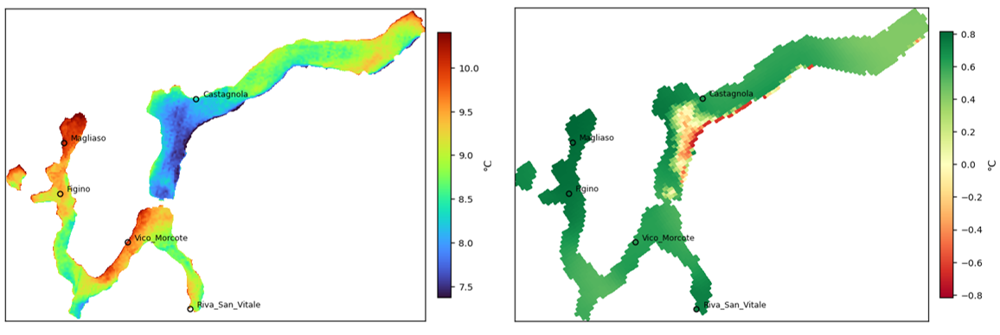
</div>

Surface-only assimilation of the five stations around Lake Lugano gives promising first results: against a satellite surface-temperature snapshot (left), the assimilated run is closer than the operational Alplakes run in 94 % of the cells (right, green). The first results also point clearly at the need for a vertical localization mechanism, or for deep measurements where they exist. Beyond that, it opens up possibilities to explore also assimilating the satellite surface temperature itself providing the whole lake surface, but at lower resolution.

---
---

# Appendices

## Appendix A: The filters in full

### A.1 EnKF

Two quantities are computed from the ensemble spread:

```
PHᵀ  ≈  Aᶠ (HAᶠ)ᵀ / (N−1)          how the whole column co-varies with the measured depths
HPHᵀ ≈  (HAᶠ)(HAᶠ)ᵀ / (N−1)        the forecast's own spread at the observed locations
```

The first is the one that matters most for a 1D lake column: it is what lets an observation at 5 m adjust the temperature at 12 m, because the ensemble says those depths move together. The gain then weighs the two uncertainties,

```
K  =  PHᵀ (HPHᵀ + R)⁻¹
```

and each member is updated with **its own perturbed observation**,

```
xᵢᵃ  =  xᵢᶠ + K (dᵢ + εᵢ) ,      εᵢ ~ N(0, R)
```

which helps prevent ensemble collapse, i.e. the spread shrinking to nothing and the filter ceasing to listen to the observations at all.

| symbol | meaning |
|---|---|
| N | ensemble size |
| A | ensemble spread about the mean |
| P | forecast error covariance |
| R | observation error covariance |
| K | Kalman gain |
| H | observation operator |
| X | state vector (forecast / analysis) |
| dᵢ | *innovation* = observation − member forecast |
| εᵢ | observation perturbation drawn for member i |

The structure of K explains the entire calibration effort in §7 and §9: it is essentially **model spread / (model spread + observation error)**. If R is too small the filter believes the observations completely and pushes the model around. If R is too large you pay for an ensemble that corrects very little and ends up reproducing a free run. There is no neutral choice; it is always a balance.

### A.2 The PF (OpenDA)

A SIR particle filter with residual resampling. Each member is weighted by the Gaussian likelihood of its own innovation,

```
wᵢ  ∝  exp( −½ · dᵢᵀ R⁻¹ dᵢ ) ,      w̃ᵢ = wᵢ / Σⱼ wⱼ ,      Σᵢ w̃ᵢ = 1
```

after which members are resampled so each is duplicated roughly in proportion to `w̃ᵢ`. Copies are exact clones of the full model state.

Note what does *not* appear: no gain, no covariance, no `PHᵀ`. The PF never asks how the column co-varies. It cannot use an observation at 5 m to construct a correction at 12 m; it can only prefer members that already happened to be right at both.

**This is the weak point at our ensemble size.** With 20 members and a state vector spanning every depth cell, the likelihood is sharply peaked: a few members can dominate, the filter can collapse to a single particle, resampling fills the ensemble with copies of one trajectory, and the spread is almost all gone until the following day's forcing perturbations rebuild it. That is the well-known dimensionality limitation of particle filters, and it is why the EnKF is the operational choice.

### A.3 The native engine's "PF" is a selection scheme

The native engine scores each member by a depth-weighted RMSE over the window (hourly data),

```
RMSEᵢ = sqrt( Σ_z w_z (xᵢ(z) − y(z))² / Σ_z w_z )
```

with trapezoidal layer thicknesses as weights `w_z`, so a tight cluster of sensors does not outvote a sparsely instrumented part of the column. The filter then clones the best member onto all the others. In the language above, that is a particle filter whose weights have been replaced by a hard `argmin`:

```
w̃ᵢ = 1 for the single best member, 0 otherwise
```

It sits permanently at the degeneracy the real PF only falls into occasionally. It is *best-member selection*, not Bayesian inference, and it is kept as a cheap reference rather than a competitor. The "Selection" column in §6.1 is this scheme; the "PF (OpenDA)" column is the real SIR filter.

## Appendix B: Perturbation calibration

Each member gets one AR(1) noise series per variable added to the control `Forcing.dat`:

```
xₜ = φ·xₜ₋₁ + σ·εₜ ,      ε ~ N(0,1) ,      φ = exp(−1/τ)
```

The two parameters are fitted from **different data and kept strictly separate**.

**Amplitude: measured.** The stationary standard deviation `σ/√(1−φ²)` is fitted from the ICON residual, `s = std(ICON lake mean − control Forcing.dat)`: how far the reanalysis actually strays from the control forcing. Fitted once per lake and committed.

**Persistence: bracketed, not measured.** No dataset gives us the decorrelation time of the *forcing error*, so we bracket it between two proxies, each contaminated in a known direction:

- *Floor*: the ACF of the ICON residual. An approximation of the error ACF after averaging; its 1/e crossing comes early.
- *Ceiling*: the ACF of the station signal itself. This measures how long the *weather* persists, not how long the *error* does. A forecast already captures the slow synoptic structure and fails on the fast small-scale part, so the error is enriched in fast components and should decorrelate sooner.

On Upper Lugano GLOB that gives `1.39 h < τ_err < 7.17 h`.

**The envelope is the production choice**: per channel, take whichever end has the *longer* τ. Two reasons. First, the bracket does not always hold: on Maggiore V, Geneva V and Hallwil U the supposed floor e-folds *later* than the ceiling, which falsifies the floor argument on those channels, because that residual is carrying a slowly drifting bias rather than white grid noise. Second, and decisively, taking the shorter end would shorten persistence, and short persistence costs spread. Under-dispersion is the failure mode we already have.

### Two traps this encoding avoids

**Never fit AR(1) to raw GLOB.** Its autocorrelation is dominated by the diurnal cycle, not by cloud persistence: a lag-1 correlation of 0.934 implies τ = 14.67 h, while the ACF actually e-folds at 4.28 h. The ACF is periodic, not exponential, so fitting it raw injects a radiation perturbation roughly **10× too persistent**. GLOB is fitted on the **clearness index** (GLOB / clear-sky, daytime only); wind on the **diurnal anomaly**, with the lake breeze removed.

**σ is not the perturbation's size:** it is the size of one hourly kick. The spread is `σ/√(1−φ²)`, because a persistent process accumulates its past kicks. Raising φ at fixed σ therefore also raises the amplitude, which confounds persistence with amplitude and makes the comparison uninterpretable. So σ is always re-derived to hold the stationary std at the ICON-fitted value, `σ = s·√(1−φ²)`. Note that σ *falls* as the perturbation becomes more persistent: smaller kicks, but they accumulate further.

Both bounds live in `perturbations/<lake>.json` under `persistence.bounds`; `stationary_std` is stored once and both bounds derive their σ from it, so the two ends cannot drift apart in amplitude.

## Appendix C: Localization implementation

Radii are derived offline per lake from a free ensemble run in the stratified season; the radius at a depth is the smallest separation at which correlation first drops below the threshold (default 0.45). That radius is the **support** of a Gaspari–Cohn taper: weight 1 at zero separation, falling smoothly to exactly 0 at the radius. Two matrices are built from it: a *(state, obs)* taper for `PHᵀ` and an *(obs, obs)* taper for `HPHᵀ`.

**Both sides must be tapered, not just `PHᵀ`.** The tempting shortcut is to taper only the cross-covariance, since that is the term that spreads the correction. But the gain also contains `(HPHᵀ + R)⁻¹`, and if that inverse is still built for the *full* observation set, the two halves of the gain disagree about which observations exist.

**The taper must not be a boxcar.** A binary on/off mask can produce a correlation structure that is no longer positive semi-definite: negative eigenvalues, and a covariance matrix that is mathematically invalid.

The taper accepts two arbitrary depth axes; per-depth radii are interpolated from the table and held **flat past the table's ends** rather than extrapolated; and the support of a pair is the **mean** of the two radii, which is what keeps ρ symmetric. Deleting `localization/<lake>.json` is the kill switch; the scheme falls back to a flat 5 m radius.

The intended consequence is that nothing far below the deepest observation gets updated. The deep water free-runs, and that is correct behaviour rather than a limitation: there is no information down there, so the model should be trusted rather than nudged by noise.

## Appendix D: Run configuration behind the numbers

- **Ensemble:** 20 members, generated by AR(1) forcing perturbation on wind U, wind V and solar radiation.
- **Period:** 2025 calendar year, daily assimilation at a per-lake night-time hour (23Z–06Z).
- **Engines:** native Python EnKF and OpenDA, configured from identical inputs, perturbed forcings, warmup and observation series, so that residual differences are the algorithm alone.
- **Observations:** causally filtered below 4 m with a per-lake seiche-derived window, thinned to a per-lake target vertical grid, retained at the assimilation hour.
- **Scoring:** RMSE against hourly observations unless stated otherwise; §8.2 and the CTD table in §9.3 are scored against CTD casts.

## Appendix E: Potential FAQ

**Why only 20 members?** Cost, in the operational chain. Twenty is what we can afford daily across seven lakes. It is a real limitation, not a choice we would defend on statistical grounds.

**Isn't filtering the observations just throwing away real signal?** Yes, and deliberately. The sensor is right and the signal is real. But it is an internal-wave displacement that a 1D column cannot produce, so feeding it to the filter asks the model to reproduce something it structurally cannot.

**Why does better calibration not give better accuracy?** Calibration means the filter's stated uncertainty matches the innovations it sees. That is self-consistency. It says nothing about whether the correction goes in the right direction at the right depth.

**What is the single biggest limitation?** Ensemble under-dispersion. We generate spread only at the surface, through three forcing variables, and it reaches depth only by mixing.
